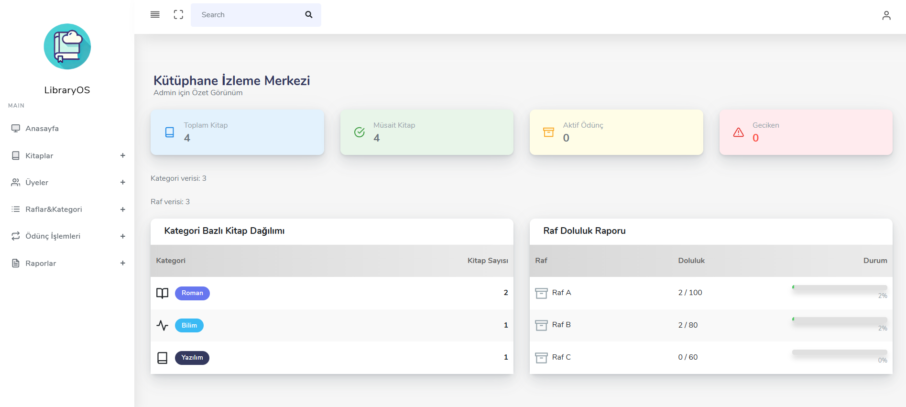
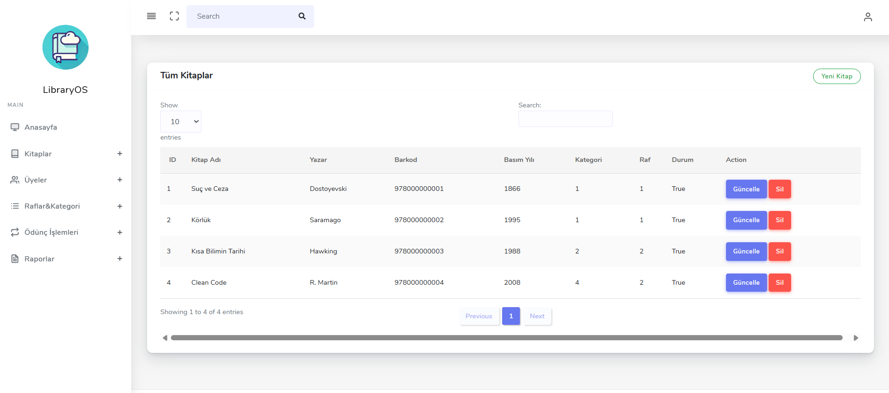
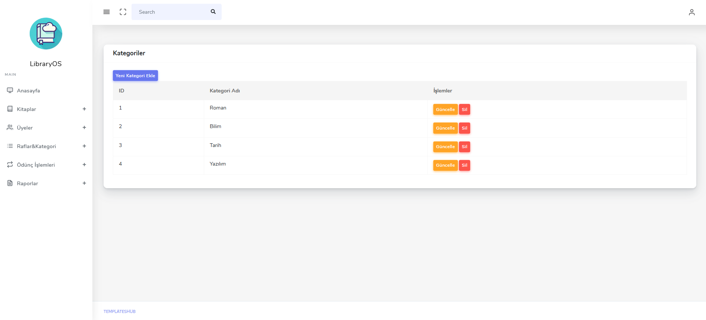
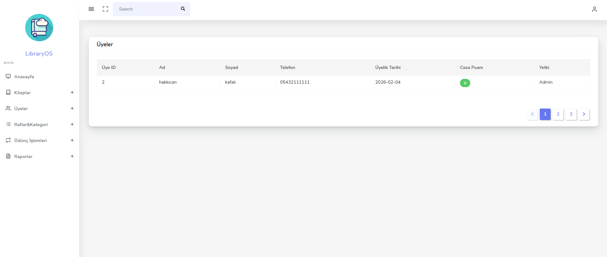

# KutuphaneMvc

ASP.NET MVC 5 ile geliştirilmiş basit bir **Kütüphane Yönetim Sistemi**.  
Staj döneminde CRUD, Entity Framework ve MVC pattern pratiği amacıyla yapılmıştır.

## Özellikler
- Kitap ekleme / listeleme / güncelleme / silme
- Üye yönetimi
- Kategori yönetimi
- Emanet (ödünç alma/verme) takibi

## Teknolojiler
- ASP.NET MVC 5
- .NET Framework 4.7.2
- Entity Framework 6
- Bootstrap 3, jQuery

## Çalıştırma Notu
Bu proje SQL Server veritabanına bağlıdır.
Staj döneminde geliştirildiği için veritabanı dosyası repoya eklenmemiştir.
Proje yapısı ve ekran görüntüleri üzerinden incelenebilir.

## Screenshots

### Dashboard

### Books Management

### Category List

### Members Page

### New Member Form

